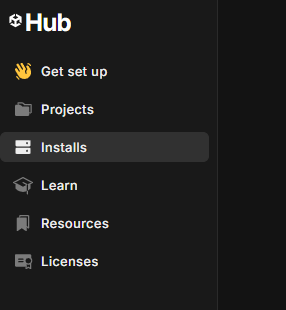
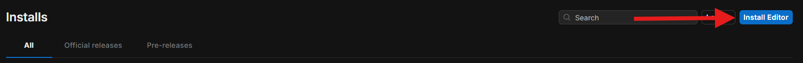
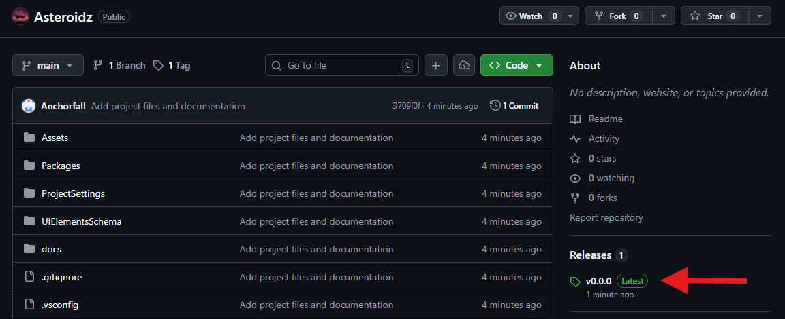

# Asteroidz

Follow these instructions to download the Unity project that will be used in this assignment.

## Install Unity

To install Unity, follow these instructions on how to [install Unity Hub](https://unity.com/developer-tools?clickref=1110lNi66qt&utm_source=partnerize&utm_medium=affiliate&utm_campaign=unity_affiliate&gad_source=1&gad_campaignid=22883287084&gbraid=0AAAABA_4ouItrSaNIPt_9G9C4oSBfE7UL&gclid=CjwKCAiAjojLBhAlEiwAcjhrDu0RegHvmBmY4XKHNU7CYglS2S5cJ6jKJ4BphRXL6uaMhAY_qhv0QxoCaKcQAvD_BwE).

Once Unity Editor is installed, click on the 'Installs' page to the left...



Do you see Unity 6.3 LTS in the available options?

If so, skip to the  section.

If you do not see Unity 6.3 in the available editor versions, click 'Install Editor' ...



... and then select version 6.3 LTS from the available options. This will install the Unity version required to open the application.

## Download Project

To download the project files as a zip or tar file:

1. Open the [GitHub repository](https://github.com/klistener/Asteroidz) again in a separate tab, positioning this readme so you can still refer to it.

2. Select 'v0.0.0' from 'Releases':



2. Download the project as either a zip or tar.gz file:


If you are familiar with git and already have it installed, you can also just clone the repository:

```
git clone https://github.com/klistener/Asteroidz.git
```

## Open Project

Return to Unity Hub, and click 'Projects'. Click on the 'Add' dropdown, and click 'Add project from disk'.


Select whatever folder you previously saved the Unity project to. You can now open the project.