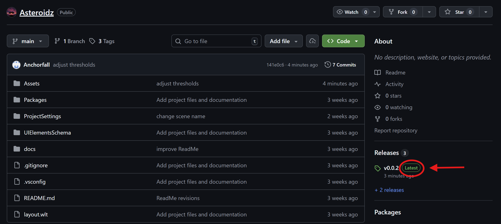

# Asteroidz

This repository contains a Unity project - the source code and configuration files for the game that you will be editing in this assignment. Follow these instructions to download the project.

## Install Unity

A specific version of Unity Editor (Unity 6.3 LTS) is needed to open this Unity project. To install it, you must first install a separate application called **Unity Hub**. Unity Hub is a utility for installing and managing different versions of Unity Editor. 

If you do not already have Unity Hub, go [here](https://unity.com/developer-tools?clickref=1110lNi66qt&utm_source=partnerize&utm_medium=affiliate&utm_campaign=unity_affiliate&gad_source=1&gad_campaignid=22883287084&gbraid=0AAAABA_4ouItrSaNIPt_9G9C4oSBfE7UL&gclid=CjwKCAiAjojLBhAlEiwAcjhrDu0RegHvmBmY4XKHNU7CYglS2S5cJ6jKJ4BphRXL6uaMhAY_qhv0QxoCaKcQAvD_BwE). Once the installation is complete, click on the 'Installs' page to the left...


Do you see Unity 6.3 LTS (6000.3) in the available options?

**If so**, skip to the [download project](#download-project) section.

**If not**, click 'Install Editor' ...


... and then select version 6.3 LTS from the available options, to download / install version 6.3 of Unity. It may take up to 30 minutes. 

## Download Project

To download the project files as a zip or tar file:

1. Open the [GitHub repository](https://github.com/klistener/Asteroidz) again in a separate tab, positioning this readme so you can still refer to it.

2. Select the latest release:



2. Download the project as either a zip or tar.gz file:


If you are familiar with git and already have it installed, you can also just clone the repository:

```
git clone https://github.com/klistener/Asteroidz.git
```

## Open Project

Return to Unity Hub, and click 'Projects'. Click on the 'Add' dropdown, and click 'Add project from disk'.


Select whatever folder you previously saved the Unity project to. You can now open the project.